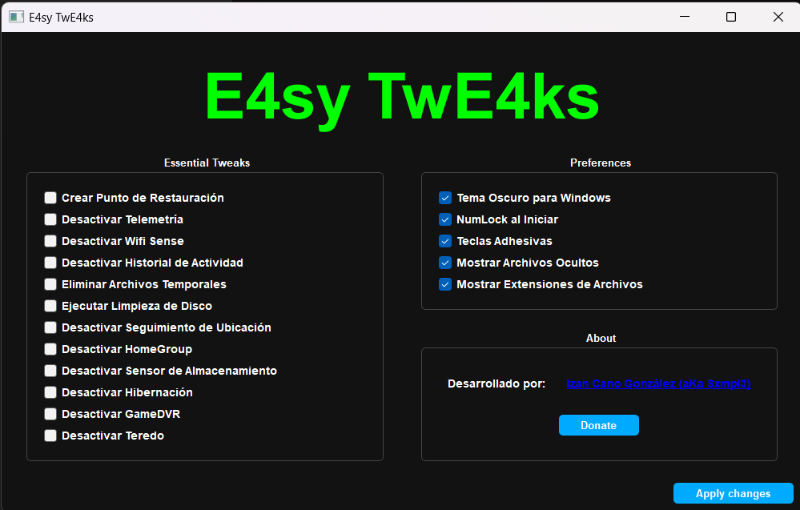

# Easy Tweaker

Easy Tweaker es una herramienta fácil de usar para ajustar y optimizar la configuración de tu sistema Windows. Esta aplicación, desarrollada con PyQt, proporciona una interfaz gráfica de usuario (GUI) intuitiva para aplicar varios ajustes y configuraciones con solo unos clics. La aplicación requiere permisos de administrador para ejecutar ciertos cambios en el sistema.



## Características

- **Essential Tweaks**: Conjunto de ajustes esenciales para mejorar el rendimiento y la privacidad del sistema.
  - Crear Punto de Restauración
  - Desactivar Telemetría
  - Desactivar Wifi Sense
  - Desactivar Historial de Actividad
  - Eliminar Archivos Temporales
  - Ejecutar Limpieza de Disco
  - Desactivar Seguimiento de Ubicación
  - Desactivar HomeGroup
  - Desactivar Sensor de Almacenamiento
  - Desactivar Hibernación
  - Desactivar GameDVR
  - Desactivar Teredo

- **Preferences**: Ajustes de preferencias para personalizar la experiencia del usuario.
  - Tema Oscuro para Windows
  - NumLock al Iniciar
  - Teclas Adhesivas
  - Mostrar Archivos Ocultos
  - Mostrar Extensiones de Archivos

## Requisitos

- Python 3.6+
- PyQt5
- permisos de administrador para ejecutar algunos ajustes

## Instalación

1. Clona este repositorio:

```bash
git clone https://github.com/Sxmpl3/Easy-Tweaker.git
cd Easy-Tweaker

```

- Podras ejecutar el script src/main.py con python, o ejecutar el .exe (solo en windows) que encontraras en la carpeta dist.

